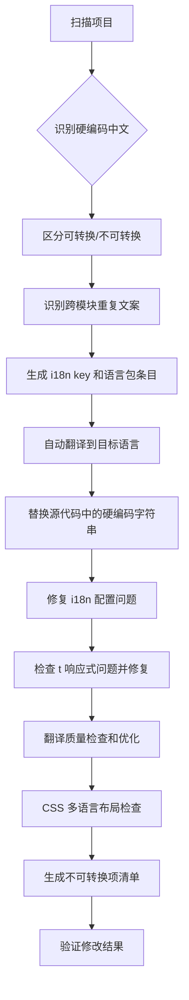

# 技术设计文档

> 国际化自动化工具 - 技术实现方案  
> 最后更新：2026-04-27

## 目录

- [核心能力需求](#核心能力需求)
- [技术栈建议](#技术栈建议)
- [实施阶段](#实施阶段)
- [核心流程](#核心流程)
- [配置文件示例](#配置文件示例)
- [架构设计](#架构设计)

---

## 核心能力需求

### 1. 代码分析

- **AST 解析 Vue/JS/TS 文件**
- **识别硬编码中文**（排除变量名、注释、URL）
- **识别不可转换的中文**：
  - 与后端交互的 value 值（如枚举值、状态码等）
  - 图片中的中文文字（需替换为多语言图片资源）
  - SVG 中的中文文字（需提取为 i18n 或替换为多语言 SVG）
- **识别已有 i18n 调用模式**
- **识别 createApp 实例及插件安装**
- **识别 t() 响应式问题**（静态常量/对象中的 t() 调用）
- **识别可复用的公共翻译**（跨文件/跨模块重复出现的文案）

### 2. 项目结构理解

- 自动定位 i18n 配置文件
- 识别 monorepo 结构（apps/*, packages/*）
- 分析共享包依赖关系
- 识别 shared-i18n 共享翻译与应用本地翻译的关系
- 识别可复用的公共翻译并建议统一管理（避免重复定义）

### 3. 代码生成

- 生成语义化 i18n key（如 `editorCore.pleaseSelect`）
- 替换硬编码为 t() 调用
- 自动添加 useI18n() 导入
- 为 createApp 添加 .use(i18n)
- 将含 t() 的静态对象改为 computed/工厂函数（响应式修复）

### 4. 翻译能力

- 集成翻译 API（Google Translate / DeepL）
- 批量翻译并更新所有语言包
- 保留插值变量格式
- 支持术语表
- 翻译质量检查（中式英语检测、冗余表达检测、RTL 拼接问题检测）
- 语种特殊化处理（如阿语 RTL 布局适配建议）

### 5. 验证能力

- 检查 i18n 安装完整性
- 检查 key 是否存在
- 检查语言包完整性
- 生成覆盖率报告
- 检查 CSS 固定宽度是否适配多语言
- 检查表格列宽是否使用 min-width
- 检测不可转换的中文（后端交互 value、图片/SVG 中的文字）
- 检测重复翻译 key（建议合并到 shared-i18n）

### 6. 交互能力

#### CLI 命令

```bash
# 扫描硬编码中文
i18n-tool scan --path apps/report

# 自动修复（添加 i18n 调用）
i18n-tool fix --path apps/report --auto-translate

# 验证 i18n 配置
i18n-tool validate

# 生成翻译报告
i18n-tool report

# 检查 t() 响应式问题
i18n-tool check-reactive --path apps/report

# 翻译质量检查
i18n-tool quality --locale en --check chinglish,redundant

# 检查 CSS 多语言适配
i18n-tool check-layout --path apps/report

# 检测不可转换的中文
i18n-tool detect-untranslatable --path apps/report

# 检测重复翻译 key
i18n-tool detect-duplicates --suggest-shared
```

#### MCP Server 工具

- `scan_hardcoded_strings` - 扫描硬编码字符串
- `fix_i18n_issues` - 自动修复 i18n 问题
- `validate_i18n_setup` - 验证 i18n 配置
- `translate_strings` - 批量翻译字符串
- `check_reactive_issues` - 检查 t() 响应式问题
- `check_translation_quality` - 翻译质量检查
- `detect_untranslatable` - 检测不可转换的中文（后端 value、图片/SVG）
- `detect_duplicate_keys` - 检测重复翻译 key，建议合并到共享包

#### Skill 功能

- 交互式选择需要国际化的文件/目录
- 预览修改前后的对比
- 支持批量操作和单个文件操作

---

## 技术栈建议

| 技术领域 | 推荐方案 | 说明 |
|---------|---------|------|
| **AST 解析** | `@babel/parser`, `@vue/compiler-sfc` | Vue SFC 和 JS/TS 文件解析 |
| **代码转换** | `jscodeshift`, `@babel/traverse` | AST 遍历和代码修改 |
| **翻译 API** | `@google-cloud/translate`, `deepl-node` | 商业翻译服务 |
| **本地翻译** | `opus-mt`, `nllb` | 离线翻译模型（隐私保护） |
| **CLI 框架** | `commander`, `inquirer` | 命令行交互 |
| **MCP Server** | Anthropic MCP SDK | Claude Code 集成 |
| **缓存** | `better-sqlite3` | 翻译缓存数据库 |
| **并行处理** | `worker_threads` | 多线程扫描 |

---

## 实施阶段

### Phase 1: 基础扫描和分析 ✅ 已完成

- ~~实现硬编码中文扫描~~
- ~~实现 i18n 配置检查~~
- ~~生成问题报告~~

**完成方式**：通过手动 + Claude Code 辅助完成，累计处理 4 个子应用 + 1 个 agent 应用。

### Phase 2: 自动修复 ✅ 已完成

- ~~实现代码转换（硬编码 → t() 调用）~~
- ~~实现 createApp 修复~~
- ~~实现语言包更新~~

**完成方式**：通过手动 + Claude Code 辅助完成。额外解决了 t() 响应式问题、JSX 列配置问题等。

### Phase 3: 翻译集成 ✅ 已完成

- ~~集成翻译 API~~
- ~~实现批量翻译~~
- ~~支持术语表~~

**完成方式**：使用 Claude 进行翻译生成，人工审查后提交。完成了全语种翻译优化（英语去中式英语、西语修语法、阿语修 RTL 拼接）。

### Phase 4: 工具化 ⏳ 未开始

基于 Phase 1-3 积累的经验和模式，提炼为可复用的工具。优先级和范围需根据项目需求确定。

#### 4.1 CLI 工具（优先级：中）

- 将扫描/修复/验证逻辑封装为 Node.js CLI
- 支持配置文件（.i18nrc.json）定义项目规则
- 集成到 CI/CD（可在 pre-commit 或 PR check 中运行）

#### 4.2 MCP Server（优先级：高）

- 暴露 i18n 相关工具给 Claude Code
- 自动分析上下文，减少手动指定路径
- 直接在 Claude Code 会话中调用

#### 4.3 Claude Code Skill（优先级：高）

- 封装完整的 i18n 改造工作流
- 交互式选择、预览、确认
- 自动调用 MCP Server 工具

---

## 核心流程



### 详细步骤

1. **扫描项目，识别硬编码中文**
2. **区分可转换与不可转换的中文**（后端交互 value 不转换、图片/SVG 中的文字单独标记）
3. **识别跨模块重复文案，建议合并到 shared-i18n 统一管理**
4. **生成 i18n key 和语言包条目**
5. **自动翻译到目标语言**
6. **替换源代码中的硬编码字符串**
7. **修复 i18n 配置问题**（如缺少 `.use(i18n)`）
8. **检查 t() 响应式问题并修复**
9. **翻译质量检查和优化**
10. **CSS 多语言布局检查**
11. **生成不可转换项清单**（供人工处理）
12. **验证修改结果**

---

## 配置文件示例

### .i18nrc.json

```json
{
  "i18n": {
    "locales": ["zh", "en", "es", "ar"],
    "defaultLocale": "zh",
    "langDir": "src/lang",
    "sharedI18nPackage": "shared-i18n",
    "exclude": ["node_modules", "dist", "*.test.js"],
    "keyPrefix": "auto",
    "translationService": "claude",
    
    "qualityChecks": {
      "chinglish": true,
      "redundantExpressions": true,
      "rtlConcatenation": true
    },
    
    "reactiveChecks": {
      "staticObjectWithT": true,
      "refAssignmentWithT": true
    },
    
    "layoutChecks": {
      "fixedWidth": true,
      "tableColumnWidth": true
    },
    
    "untranslatablePatterns": {
      "backendValues": ["status", "type", "code"],
      "imageExtensions": [".png", ".jpg", ".svg"],
      "svgTextNodes": true
    },
    
    "sharedTranslationDetection": {
      "enabled": true,
      "minOccurrences": 3,
      "suggestMerge": true
    },
    
    "rtlSupport": {
      "enabled": false,
      "locales": ["ar"],
      "checkMirrorLayout": true
    },
    
    "terminology": {
      "报告": "report",
      "知识库": "knowledge base",
      "深度研究": "deep research",
      "信息源": "information source"
    },
    
    "security": {
      "translationMode": "hybrid",
      "sensitivePatterns": [
        "\\d{1,3}\\.\\d{1,3}\\.\\d{1,3}\\.\\d{1,3}",
        "\\d{11}",
        "@[\\w-]+\\.(com|cn|net)"
      ],
      "requireApproval": true,
      "auditLog": {
        "enabled": true,
        "path": ".i18n-audit.log"
      }
    },
    
    "performance": {
      "parallelScan": {
        "enabled": true,
        "maxWorkers": 8
      },
      "translationCache": {
        "enabled": true,
        "path": ".i18n-cache.db",
        "ttl": "365d"
      },
      "batchTranslation": {
        "enabled": true,
        "batchSize": 20
      }
    },
    
    "versionControl": {
      "autoCommit": true,
      "commitPrefix": "[i18n-tool]",
      "branchPrefix": "i18n-auto-fix",
      "stageCommits": true,
      "generateReport": true
    }
  }
}
```

---

## 架构设计

### 分层架构

```
i18n-automation-tool/
├── core/                          # 核心层（框架无关）
│   ├── scanner/                   # 硬编码扫描
│   │   ├── chinese-detector.js
│   │   ├── untranslatable-detector.js
│   │   └── duplicate-detector.js
│   ├── translator/                # 翻译生成
│   │   ├── api-translator.js
│   │   ├── local-translator.js
│   │   └── cache-manager.js
│   ├── quality-checker/           # 翻译质量检查
│   │   ├── chinglish-detector.js
│   │   ├── redundancy-detector.js
│   │   └── rtl-checker.js
│   └── validator/                 # 验证器
│       ├── config-validator.js
│       ├── coverage-reporter.js
│       └── layout-checker.js
│
├── adapters/                      # 适配器层（框架相关）
│   └── vue3/                      # Vue 3 适配器
│       ├── ast-parser.js          # Vue SFC 解析
│       ├── code-replacer.js       # 代码替换
│       ├── reactive-checker.js    # 响应式检测
│       └── ui-lib/                # UI 库适配
│           └── element-plus.js
│
├── cli/                           # CLI 工具
│   ├── commands/
│   │   ├── scan.js
│   │   ├── fix.js
│   │   ├── validate.js
│   │   └── report.js
│   └── index.js
│
├── mcp-server/                    # MCP Server
│   ├── tools/
│   │   ├── scan-hardcoded.js
│   │   ├── fix-issues.js
│   │   └── validate-setup.js
│   └── server.js
│
└── skill/                         # Claude Code Skill
    ├── workflow.js
    └── interactive.js
```

### 核心模块说明

#### 1. Scanner（扫描器）

**chinese-detector.js**
- 使用正则匹配中文字符
- 排除注释、变量名、URL
- 返回位置信息（文件、行号、列号）

**untranslatable-detector.js**
- 检测后端交互的 value 值
- 检测图片/SVG 中的中文
- 生成不可转换清单

**duplicate-detector.js**
- 扫描所有语言文件
- 统计相同 key 和 value 的出现次数
- 建议合并到 shared-i18n

#### 2. Translator（翻译器）

**api-translator.js**
- 集成 Google Translate / DeepL API
- 批量翻译优化
- 速率限制处理

**local-translator.js**
- 集成本地翻译模型（Opus MT）
- 离线运行，保护隐私

**cache-manager.js**
- SQLite 缓存
- 相同文案只翻译一次
- 跨项目复用

#### 3. Quality Checker（质量检查器）

**chinglish-detector.js**
- 检测中式英语模式
- 建议更地道的表达

**redundancy-detector.js**
- 检测冗余表达
- 精简翻译文案

**rtl-checker.js**
- 检测 RTL 拼接问题
- 建议 RTL 布局适配

#### 4. Validator（验证器）

**config-validator.js**
- 检查 i18n 配置完整性
- 检查 createApp 是否注册 i18n

**coverage-reporter.js**
- 生成国际化覆盖率报告
- 统计已翻译/未翻译文案

**layout-checker.js**
- 检查 CSS 固定宽度
- 检查表格列宽

---

## 开发建议

### 1. 先做核心层

核心层（scanner、translator、quality-checker、validator）是框架无关的，优先开发。

### 2. 再做 Vue 3 适配器

Vue 3 适配器是当前项目的需求，优先级最高。

### 3. 最后做 CLI/MCP/Skill

在核心功能稳定后，再封装为不同形态的工具。

### 4. 测试驱动开发

每个模块都应该有单元测试和集成测试。

### 5. 文档先行

在开发前先完善文档，明确需求和接口。

---

## 性能优化

### 1. 并行扫描

使用 worker threads 并行处理文件，性能提升 6-7 倍。

### 2. 翻译缓存

使用 SQLite 缓存翻译结果，增量更新命中率 70-80%。

### 3. 批量翻译

合并多个文案一次性发送到 API，性能提升 4 倍。

### 4. 增量扫描

只扫描 git diff 中的文件，节省时间。

---

## 安全性

### 1. 数据隐私

- 敏感信息脱敏处理
- 支持本地翻译模型
- 审计日志记录

### 2. 代码安全

- 自动语法检查
- 类型检查（TypeScript）
- 回滚机制

### 3. 权限控制

- 翻译审核流程
- 锁定已批准的翻译
- 分级权限管理

---

## 相关文档

- [特殊场景处理指南](./special-cases.md) - 不可转换的中文、公共翻译管理、RTL 布局
- [生产环境实施指南](./production-guide.md) - 安全性、版本控制、团队协作、性能优化
- [经验教训](./lessons-learned.md) - 从实际改造中总结的规则和最佳实践
